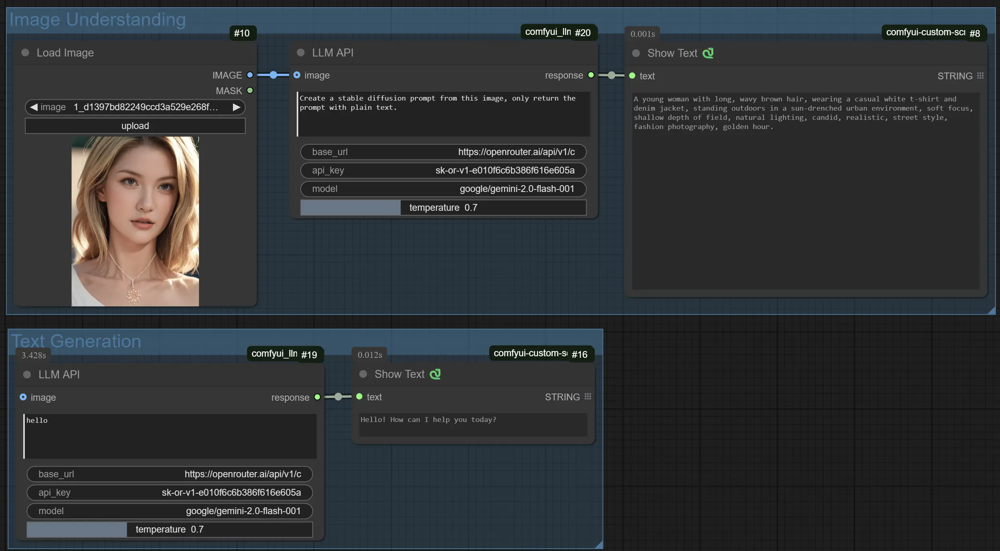

# ComfyUI LLM API Nodes

A ComfyUI extension that provides nodes for interacting with OpenAI-compatible Large Language Model (LLM) APIs.

> [!NOTE]
> This projected was created with a [cookiecutter](https://github.com/Comfy-Org/cookiecutter-comfy-extension) template. It helps you start writing custom nodes without worrying about the Python setup.



## Quickstart

1. Install [ComfyUI](https://docs.comfy.org/get_started).
1. Install [ComfyUI-Manager](https://github.com/ltdrdata/ComfyUI-Manager)
1. Look up this extension in ComfyUI-Manager. If you are installing manually, clone this repository under `ComfyUI/custom_nodes`.
1. Restart ComfyUI.

## Features

-   Make API calls to OpenAI-compatible LLM endpoints like OpenRouter
-   Support for both text-only and image+text (multimodal) prompts
-   Configurable parameters:
    -   Custom API endpoint URL
    -   API key
    -   Model selection
    -   Temperature control
-   Error handling and detailed logging
-   Compatible with models like Google's Gemini and other OpenAI-compatible APIs

## Usage

1. Add the "LLM API" node to your workflow
2. Configure the API settings:
    - Set your API key (can be loaded from OPENAI_API_KEY environment variable)
    - Choose your model (default: google/gemini-2.0-flash-001)
    - Adjust temperature (0.0 - 2.0)
3. Connect an optional image input
4. Enter your prompt
5. Run the workflow to get the LLM's response

## Develop

To install the dev dependencies and pre-commit (will run the ruff hook), do:

```bash
cd comfyui_llm_api
pip install -e .[dev]
pre-commit install
```

The `-e` flag above will result in a "live" install, in the sense that any changes you make to your node extension will automatically be picked up the next time you run ComfyUI.

## Publish to Github

Install Github Desktop or follow these [instructions](https://docs.github.com/en/authentication/connecting-to-github-with-ssh/generating-a-new-ssh-key-and-adding-it-to-the-ssh-agent) for ssh.

1. Create a Github repository that matches the directory name.
2. Push the files to Git

```
git add .
git commit -m "project scaffolding"
git push
```

## Writing custom nodes

An example custom node is located in [node.py](src/comfyui_llm_api/nodes.py). To learn more, read the [docs](https://docs.comfy.org/essentials/custom_node_overview).

## Tests

This repo contains unit tests written in Pytest in the `tests/` directory. It is recommended to unit test your custom node.

-   [build-pipeline.yml](.github/workflows/build-pipeline.yml) will run pytest and linter on any open PRs
-   [validate.yml](.github/workflows/validate.yml) will run [node-diff](https://github.com/Comfy-Org/node-diff) to check for breaking changes

## Publishing to Registry

If you wish to share this custom node with others in the community, you can publish it to the registry. We've already auto-populated some fields in `pyproject.toml` under `tool.comfy`, but please double-check that they are correct.

You need to make an account on https://registry.comfy.org and create an API key token.

-   [x] Go to the [registry](https://registry.comfy.org). Login and create a publisher id (everything after the `@` sign on your registry profile).
-   [x] Add the publisher id into the pyproject.toml file.
-   [x] Create an api key on the Registry for publishing from Github. [Instructions](https://docs.comfy.org/registry/publishing#create-an-api-key-for-publishing).
-   [x] Add it to your Github Repository Secrets as `REGISTRY_ACCESS_TOKEN`.

A Github action will run on every git push. You can also run the Github action manually. Full instructions [here](https://docs.comfy.org/registry/publishing). Join our [discord](https://discord.com/invite/comfyorg) if you have any questions!
